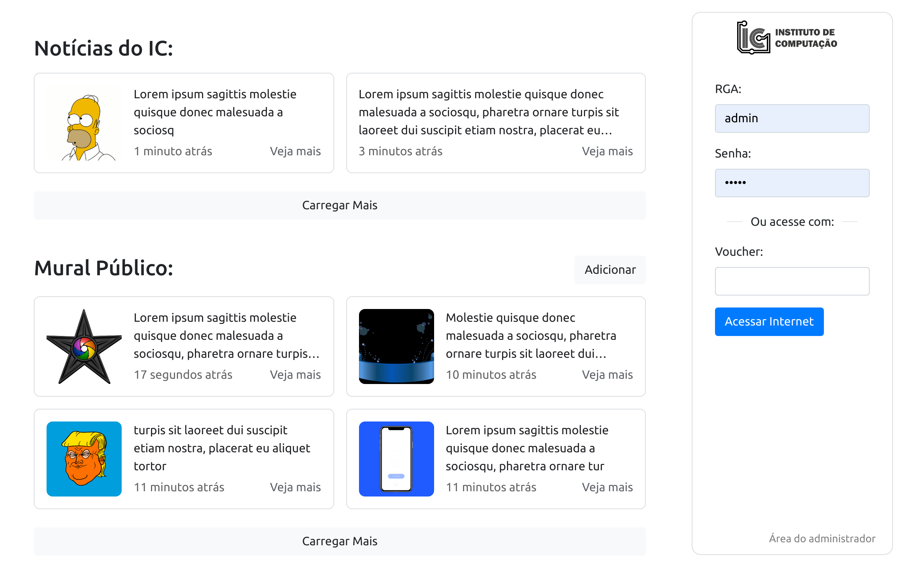
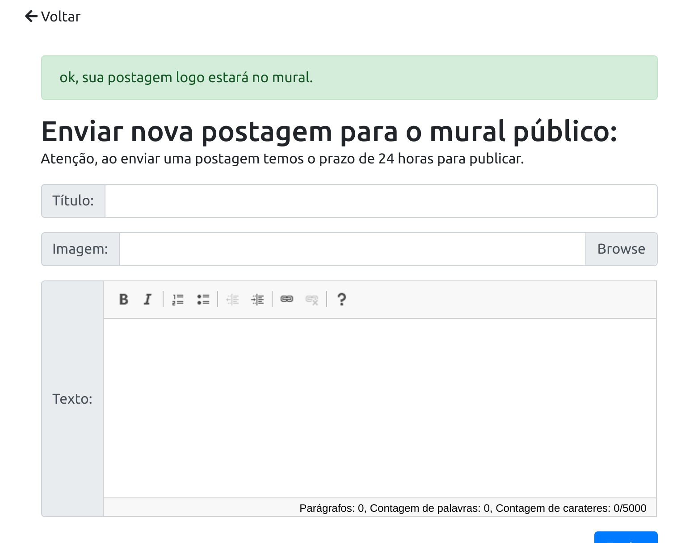
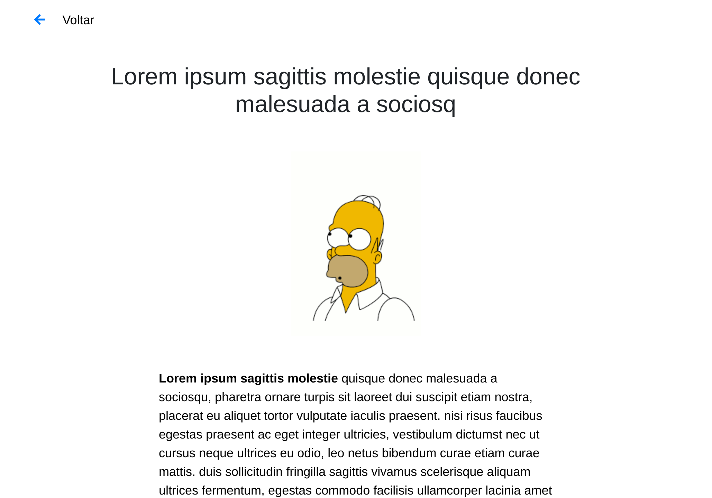
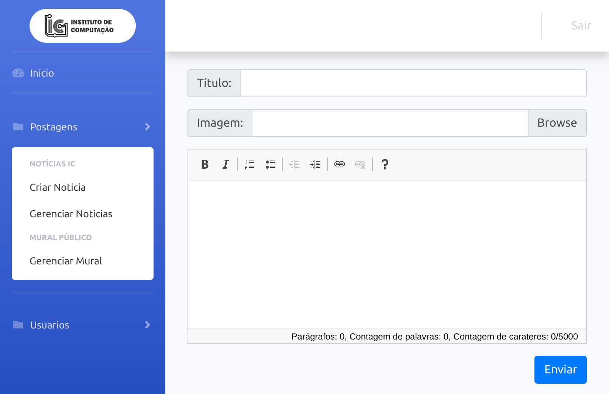

# IC ACADEMICO
Projeto de conclusão do curso de Ciência da Computação da Universidade Federal de Mato Grosso de Rodrigo Venâncio Veríssimo. Este projeto contém uma Web application para a página de autenticação do WIFI do Instituto de Computação. Melhorando a página que atualmente não é responsiva, adicionando as novidades de Notícias do IC e um Mural Público.
## Passos Iniciais
### Pré-requisitos
Servidor Web com Apache, PHP, e MySQL Instalado.

Para instalar no Ubuntu execute os comandos
```
sudo apt update
sudo apt install lamp-server^
```
### Instalação
Copie os arquivo do projeto para pasta /var/www/html/

Abra o MySQL (execute sudo mysql no terminal) e execute o comando 
```
source /var/www/html/ic_academico.sql
```
Isto criará o banco com as tabelas, um usuario para acessar o banco e um usuario admin para o painel da aplicação.
Feito isto o projeto já deve estar funcionando
## Usando
Para acessar o painel administrador o usuario e senha padrão é admin
## Mais Informações
Acesse o arquivo em [PDF](Relatório%20Final.pdf) disponivel neste repositório.
## Capturas de tela


